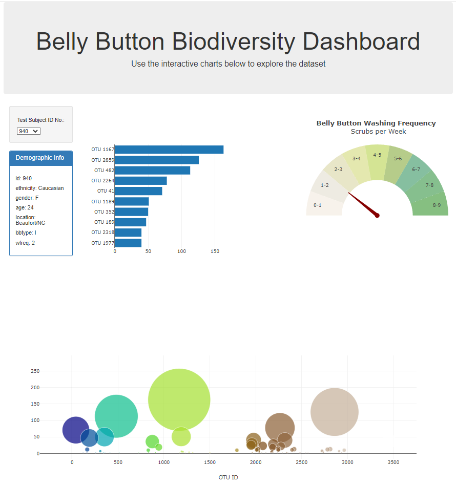

# belly-button-challenge

## BackGround:
In this assignment, we will build an interactive dashboard to explore the Belly Button Biodiversity dataset, which catalogs the microbes that colonize human navels.

The dataset reveals that a small handful of microbial species (also called operational taxonomic units, or OTUs, in the study) were present in more than 70% of people, while the rest were relatively rare.

## Dashboard Preview & Details

In this dashboard we will have 
	- a horizontal bar chart with a dropdown menu to display the top 10 OTUs found in that individual.
    - a bubble chart that displays each sample.
    - an individual's demographic information.
	- a Gauge chart to plot the weekly washing frequency of the individual.

### Refrences: 
Hulcr, J. et al. (2012) A Jungle in There: Bacteria in Belly Buttons are Highly Diverse, but Predictable. Retrieved from: http://robdunnlab.com/projects/belly-button-biodiversity/results-and-data/Links to an external site.